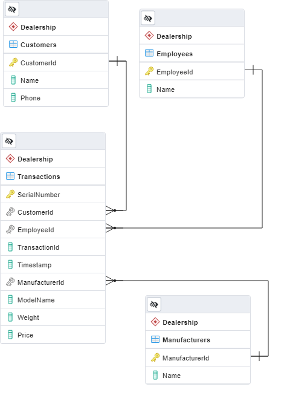

<!-- Header -->
<div>
  <h1>Section 2: Databases</h3>  
</div>

# Introduction
This section tackles the 2nd section of the Data Engineer Tech Challenge TAP. 

The prompt is as follows:
>
>You are appointed by a car dealership to create their database infrastructure. There is only one store. In each business day, cars are being sold by a team of salespersons. Each transaction would contain information on the date and time of transaction, customer transacted with, and the car that was sold.
>
>The following are known:
>
>- Each car can only be sold by one salesperson.
>- There are multiple manufacturers’ cars sold.
>- Each car has the following characteristics:
>- Manufacturer
>- Model name
>- Serial number
>- Weight
>- Price
>
>Each sale transaction contains the following information:
>
>- Customer Name
>- Customer Phone
>- Salesperson
>- Characteristics of car sold
>
>Set up a PostgreSQL database using the base `docker` image [here](https://hub.docker.com/_/postgres) given the above. We expect at least a `Dockerfile` which will stand up your database with the DDL statements to create the necessary tables. Produce entity-relationship diagrams as necessary to illustrate your design.
>
>Your team also needs you to query some information from the database that you have designed. Note that the business requirements for the database is **not limited** to the 2 queries below, do design your database to account a wide range of business use cases. You are tasked to write a `sql` statement for each of the following task:
>
>1. I want to know the list of our customers and their spending.
>
>2. I want to find out the top 3 car manufacturers that customers bought by sales (quantity) and the sales number for it in the current month.

# Additional Assumptions

(1) All Ids are 16 characters and SerialNumbers are 17 characters (Using VIN)

(2) Cars must have a Manufacturer

(3) 1 transaction per car & 1 car per transaction<br>
Implies 1-to-1 relationship between cars and transactions. Hence, Transactions and Cars can be just 1 table.<br>
This also implies that **SerialNumbers** can uniquely identify a specific transaction. The most commonly used SerialNumber is the 17 character VIN which can uniquely identify a car.

(4) Same model cars can have varying weights and prices.<br>
Assumes there can be manufacturing differences and different bargained prices for the same model. (In the real-world we would likely want to capture original listing price and sales price separately, but that is out of the scope.) <br>
This implies that price and weight can be unique for each car, even if its of the same model. Hence, we need not form a table for the Model of car. 

# Explanation of Submission
## Schema
With the assumptions and additional assumptions in mind, I've designed a specific schema and produced an Entity Relationship Diagram (ERD) to help visualise it.<br>


The schema is made of 4 tables: Customers, Employees, Manufacturers and Transactions. Customers, Employees and  Manufacturers have one-to-many relationships with Transactions.

Transactions technically consists of Cars and Models, which I had initially separated from the Transactions table, but decided against it after realising that the relationship between these are one-to-one (as per the additional assumptions).

## Approach to Developement
Following the ERD, I created the tables and assigned the columns using pgAdmin 4 which is similar to mySQL workbench.

I also utilised the software to generated the init and query SQL scripts for this assessment as well. 

Lastly, I added this line to the Dockerfile to copy the init script into the container.
```
COPY init.sql /docker-entrypoint-initdb.d/
```
The Postgres image will run any .sql scripts in this location on init.

# Usage (For Tasks) 
The following describes how the sql statements in the prompt can be tested via command line. (Can be accessed more easily via pgAdmin4 if you have it installed.)

1. Build docker-compose
```
docker-compose build
```
2. Start docker-compose
```
docker-compose up -d
```
3. Enter container
```
docker exec -it sqldb bin/bash
```
4. Log in to psql
```
psql -d mydatabase -U postgres -p 5432 
```
5. Enter Queries for each task

**Task 1:** _I want to know the list of our customers and their spending._
```
SELECT "b"."CustomerId", "b"."Name", sum("a"."Price") as "Total Spending"
FROM "Dealership"."Transactions" as a 
INNER JOIN "Dealership"."Customers" as b ON "a"."CustomerId" = "b"."CustomerId"
GROUP BY "b"."CustomerId";
```

```
    CustomerId    |     Name     | Total Spending 
------------------+--------------+----------------
 8877704716678617 | Ah Rick Chou |         453200
 8762291780512674 | Zoe Jie Lun  |         177000
 0921348557356655 | Jaejay Lin   |         240000
(3 rows)
```


**Task 2:** _I want to find out the top 3 car manufacturers that customers bought by sales (quantity) and the sales number for it in the current month._
```
SELECT "b"."ManufacturerId", "b"."Name", sum("a"."Price") as "Total Spending", count("a"."SerialNumber") as "Total Sales"
FROM "Dealership"."Transactions" as a 
INNER JOIN "Dealership"."Manufacturers" as b ON "a"."ManufacturerId" = "b"."ManufacturerId"
WHERE "a"."Timestamp" >= date_trunc('month', current_date - interval '1' month)
GROUP BY "b"."ManufacturerId" 
ORDER BY "Total Sales" Desc
Limit 3;
```

```
  ManufacturerId  |  Name  | Total Spending | Total Sales
------------------+--------+----------------+-------------
 5362322661186481 | Toyota |         327200 |           2
 8700801130150749 | Subaru |         183000 |           1
 8769142801116024 | Nissan |         120000 |           1
(3 rows)
```


