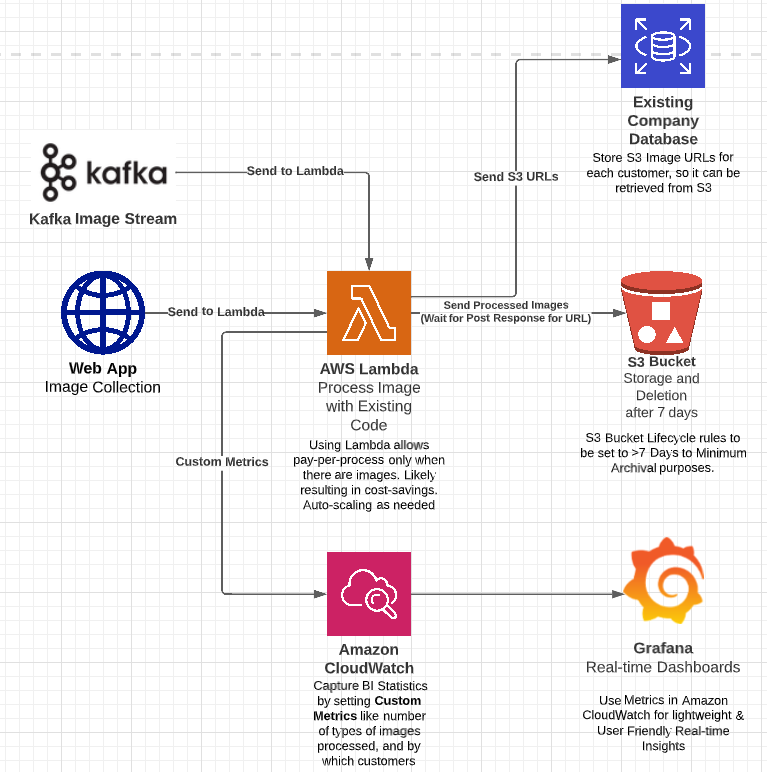

<!-- Header -->

  <h1>Section 3 System Design<h3>  

# Introduction
This section tackles the 3rd section of the Data Engineer Tech Challenge TAP. 

The prompt is as follows: 
>Prepare a presentation to your project team on how you plan to design data infrastructure on the cloud for a company whose main business is in processing images. Your role is the `Tech Lead` for this project.
>
>The company has a web application which collects images uploaded by customers. The company also has a separate web application which provides a stream of images using a Kafka stream. The company’s software engineers have already some code written to process the images.
>
>The company would like to save processed images for a minimum of **7 days for archival purposes**. Ideally, the company would also want to be able to have some Business Intelligence (BI) on key statistics including number and type of images processed, and by which customers.
>
>Produce a system architecture diagram (e.g. Visio, Powerpoint) using any of the commercial cloud providers' ecosystem to explain your design. Please also indicate clearly if you have made any assumptions at any point.
>
>Share about the `pros` and `cons` of your design to justify the decisions you have made.

# Assumptions
(1) The "separate web application which provides a stream of images using a Kafka stream" is another source of images to be processed. (I am a little unclear what the stream of image is for, hence I am assuming that it just needs to be processed.)

(2) Assume original image does not have to be stored. Hence there is no need to send Original to S3.

(3) Assume that there is an existing company database to store URL of S3 bucket images. If no database, then we can use AWS RDS or Redshift instead. 

(4) BI is only required for past 7 days data. I.e. no analysis required for historical data. If required, then metrics can either be exported from lambda to the database. 

# Submission
Slides can be accessed [here!](Cloud_Infrastructure_Pitch.pdf)

System architecture diagram: 

