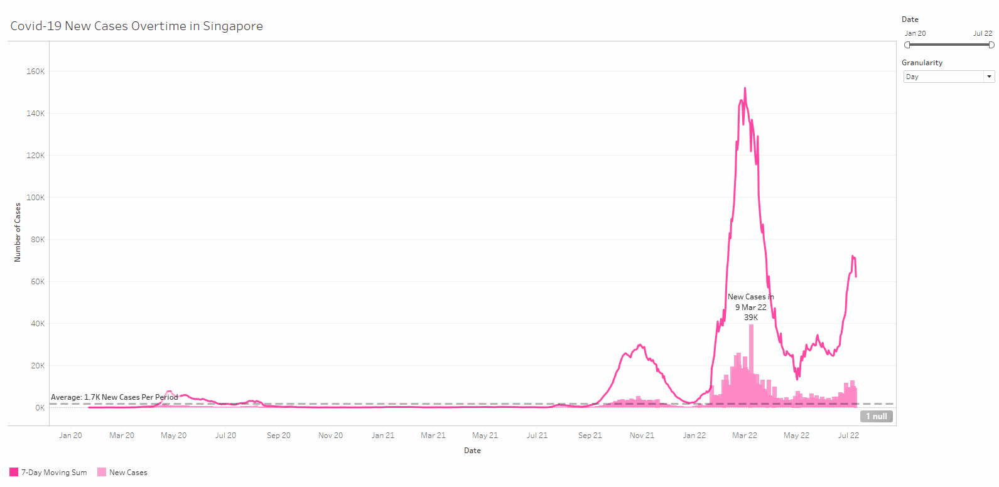
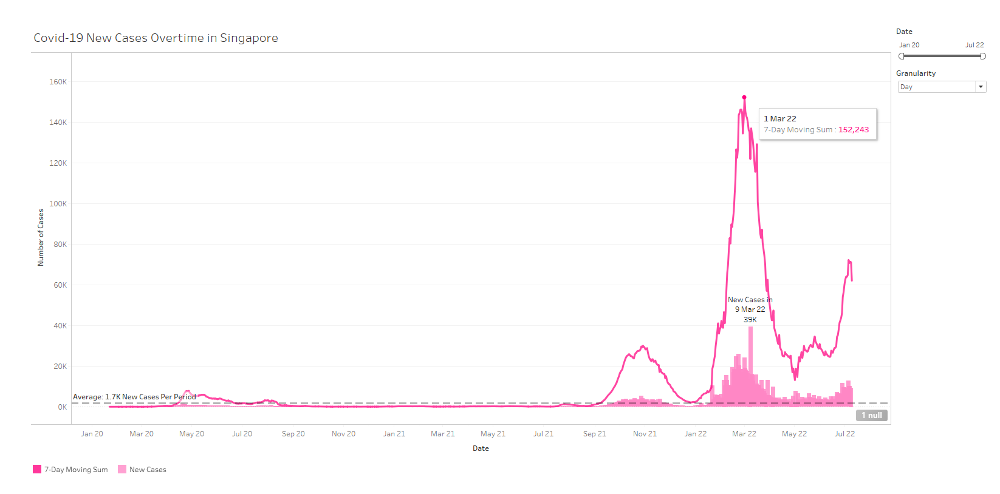
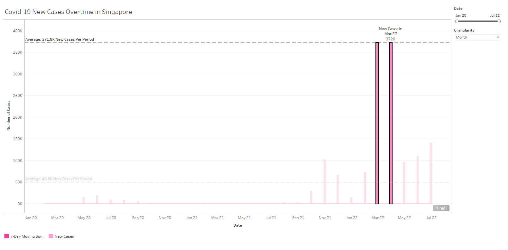
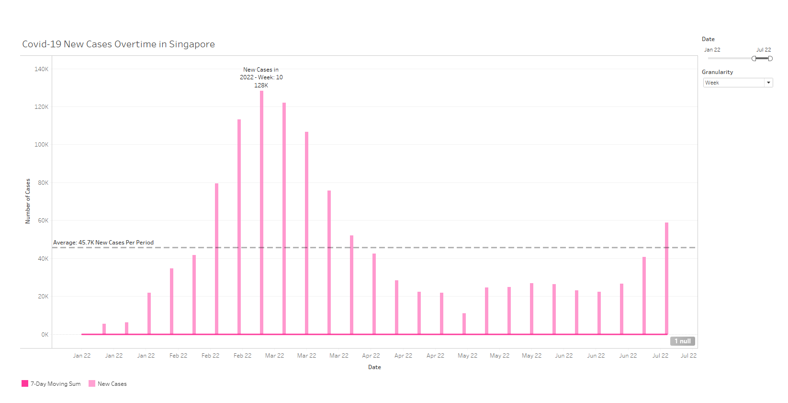

<!-- Header -->

  <h1>Section 4 Charts and APIs</h3>  

# Introduction
This section tackles the 1st section of the Data Engineer Tech Challenge TAP. 

The prompt is as follows:
>## Section 4: Charts and APIs
>
>Your team decided to design a dashboard to display the statistic of COVID19 cases. You are tasked to display one of the components of the dashboard which is to display a visualisation representation of number of COVID19 cases in Singapore over time.
>
>Your team decided to use the public data from https://documenter.getpostman.com/view/10808728/SzS8rjbc#b07f97ba-24f4-4ebe-ad71-97fa35f3b683.
>
>Display a graph to show the number cases in Singapore over time using the APIs from https://covid19api.com/.
>
>_Note: please submit screenshots of the dashboard_

# Assumptions
(1) Dashboard/Chart Component can be on any medium. I.e. Tableau.  
My assumption is that the component will be embedded in some web application. Hence, any chart that can be embedded in the web is fine. i.e. Tableau can be embedded via links.

(2) Visualisation does not have to draw from API directly. (Or at least I don't have to set it up for this section. I could have setup API ingestion using TabPy for Tableau but it requires hosting a server.)

(3) The visualisation is going to be solely focused on just the confirmed cases in singapore.

# Explanation of Submission
**Choices**  
For this submission, I extracted the data in a notebook using the requests library.  

I chose to utilise Tableau to visualise the data instead of using matplolib or other pythonic solutions. This is because developing dashboards on Tableau faster and the preset styles are a lot more professional. 

**Dashboard**  

In Tableau, I created a dual axis chart consisting of a line chart and a bar chart.

The bar chart shows the number of new cases in each period, new cases was chosen to be the metric instead of just confirmed cases, as the latter does not provide much useful information about the covid situation at each time point. This is because total confirmed cases includes people that had recovered. Hence, deriving new cases from total confirmed cases makes for a more interesting and insightful story.

While the line chart shows a 7-day moving sum of new cases. 7-day moving sum was chosen to be the metric as the current Covid isolation period is 7 days. In a sense, the 7-day moving sum shows how many Singaporeans are under quarantine (Assuming that the data is captured on the 1st day of isolation). 

The chart is controlled by two toggles, one for filtering the date range and one for changing the granularity betweens days, weeks and months. Note that since 7-days sum does not make sense for week and months granularity, its disabled for these settings.

Due to the interactive nature of Tableau visualisations, users can investigate different periods of the covid-19 pandemic. It is possible that through the inspection of historical periods, it would be possible to gain insight about future outbreaks or identify seasonal trends.

**Possible Improvements**  
However, the level of business value delivered by this dashboard can be further improved. One key idea that may increase value-add may be to add date markers for holidays or important events. I.e. marking where Chinese New Year is on the timeseries might help users to easier draw correlations between the holiday and the periods of outbreak. (In fact, the Feb and Mar 2022 saw the highest number of new cases at around 372k each.)

**Points of Interest**  

1. At least **2.6%** (152k/5.8m) of Singaporeans had covid on 1st March 2022. This number is likely greater because it discounts unreported cases and those that still had covid 7-days after reporting.  
As of 9 July 2022, this number is at 1% (62k/5.8m), much lower than 1st March, but much higher than most other days. 

2. **12.8%** (744k/5.8m) of Singaporeans got infected with Covid during Feb 2022 and March 2022. Thats one in ten within just a short span of 2 months!

3. As of 9 July 2022, we had an average of **45.7k** new cases weekly in 2022. This is compared to 0.2k in 2021 and 1.9k in 2020 in the same Jan to July period. 

